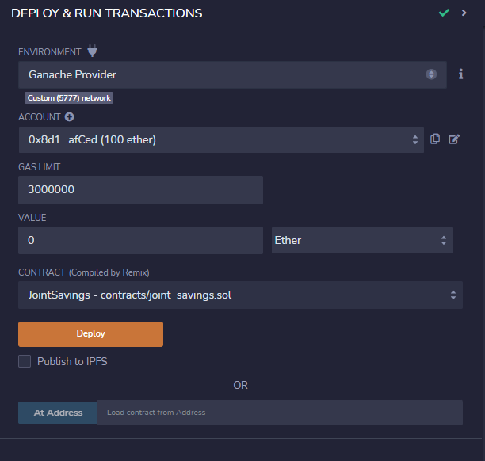
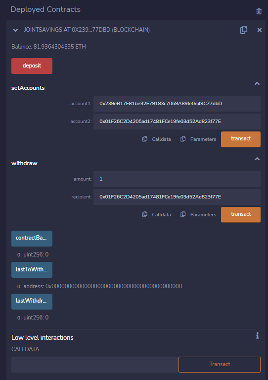

# Solidity - Smart contract transfer funds within the same Bank Account
Solidity smart contract designed to transfer ETHER between 2 accounts under the same owner. The contract recognizes when accounts are not linked under the same wallet or owner.  

---
## Purpose

### Ethereum Wallet - Test (Ganache):
- Ganache ethereum wallet used to as account #1 and account #2    
    

### Smart Contract:
-  `joint_savings.sol`
    - Solidity smart contract
- Version:

    `pragma solidity 0.5.0`

 
---
## Technologies
### Python:

    Phyton Version: **3.7.13**

### Ganache
[ganache](https://trufflesuite.com/ganache/)

### Solidity
[solidity](https://docs.soliditylang.org/en/v0.8.17/)

### Ethereum IDE - REMIX
[ethereum_remix](https://remix.ethereum.org/)

---
<!--How to run -->
## Import Streamlit
    pip install streamlit

## Run the Streamlit application
    streamlit run pychain.py

---
<!--Demo -->
### Ganache - Note initial balances

### Contract set up - before deployment

### Solidity - Transaction Record after deployment

### Ganache Transaction Record

### Solidity: Contract account set up

### Ganache Transaction Record after set up

### Validated Record (See Validated Transaction Hash)

### Ganache: Transfered Funds - Acc# 1 Deducted

### Solidity: Verified Transaction

---
<!--Version Release -->
## Version Release

### Version 1.2
-   Updated code, fixed error message with web-3
-   Tested 12/31/22

---
<!--Contributors -->
## Contributors

Jeremy Vargas

    Managing Director
    Resonant Solutions LLC
    email:    jeremyvargas@resonantsolutions.org
    linkedin: https://www.linkedin.com/in/jeremyvargas/

UW FinTech Bootcamp
- Startup code provided by institution

---
<!--License -->
## License
Tool is available under an MIT License.

Copyright (c) 2022 - Resonant Solutions, LLC

### Permissions
Permission is hereby granted, free of charge, to any person obtaining a copy of this software and associated documentation files (the “Software”), to deal in the Software without restriction, including without limitation the rights to use, copy, modify, merge, publish, distribute, sublicense, and/or sell copies of the Software, and to permit persons to whom the Software is furnished to do so, subject to the following conditions:

The above copyright notice and this permission notice shall be included in all copies or substantial portions of the Software.
### Disclaimer
The Software is provided “as is”, without warranty of any kind, express or implied, including but not limited to the warranties of merchantability, fitness for a particular purpose and noninfringement. In no event shall the authors or copyright holders be liable for any claim, damages or other liability, whether in an action of contract, tort or otherwise, arising from, out of or in connection with the software or the use or other dealings in the Software.

---
<!--Aknowledgements -->
## Aknowledgements
* [Markdown Guide](https://www.markdownguide.org/basic-syntax/#reference-style-links)

<!-- MARKDOWN LINKS & IMAGES -->
<!-- https://www.markdownguide.org/basic-syntax/#reference-style-links -->